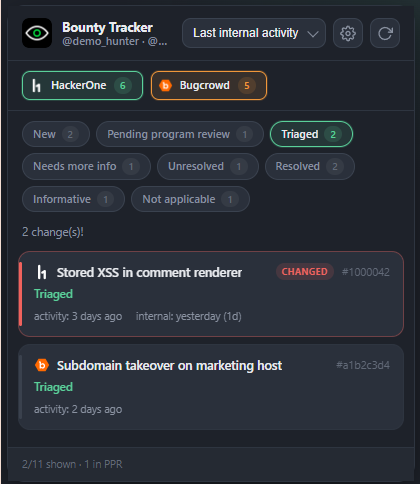
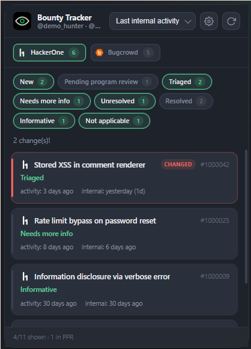
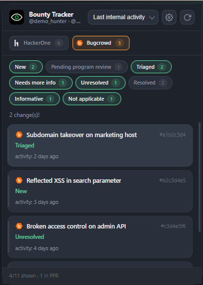
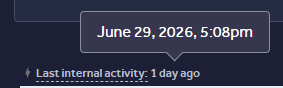
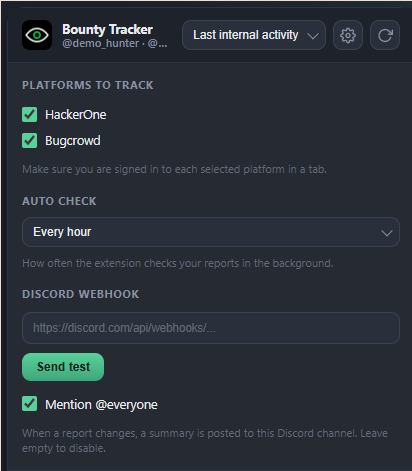

  

<h1 align="center">Bounty Report Tracker</h1>

A Chrome extension for HackerOne and Bugcrowd, built around internal activity. Fully local and privacy-safe.

A Chrome extension that watches your **HackerOne** and **Bugcrowd** reports and alerts
you when their status changes. Track one platform or both, from a single popup. Its main
reason to exist is **internal activity**.

> **Fully local.** Everything runs inside your own browser using the sessions you are already
> logged in to. No report data ever leaves your machine, there are no servers, no accounts, and
> no API keys to paste. The only outbound request the extension can make is to your own Discord
> webhook, and only if you choose to set one.

<table align="center">
  <tr>
    <td align="center"><b>HackerOne + Bugcrowd</b></td>
    <td align="center"><b>HackerOne</b></td>
    <td align="center"><b>Bugcrowd</b></td>
  </tr>
  <tr>
    <td align="center"></td>
    <td align="center"></td>
    <td align="center"></td>
  </tr>
</table>

> The screenshots above use fictional sample data, not real reports.

## Why "internal activity"

HackerOne already emails you and pushes a notification for **public** events on your
reports: a new comment, a state change, a bounty, a request for more info. You never miss
those because they land in your inbox.

What HackerOne does **not** tell you about is **internal activity**: the moment the program
or the triage team touches your report behind the scenes without posting anything public.
In the HackerOne UI this is the **"Last internal activity"** field, exposed in the API as
`report_pending_party_last_activity`. It often moves days before any public reply appears,
so it is an early signal that someone is actually looking at your report.

This is the field on a HackerOne report. It updates silently, with no email and no
notification, which is why the extension polls it for you.

This extension exists to surface exactly that signal. It polls your reports, compares each
one against the previous check, and notifies you when the internal activity timestamp moves,
even when nothing public has happened yet. The same diff also catches `substate` changes and
new public activity, so the popup stays a complete picture, but internal activity is the part
you cannot get anywhere else.

## Platforms

The extension supports **HackerOne** and **Bugcrowd**. Open the settings panel in the popup
(the gear icon) and tick the platforms you want to track. You can run one or both at once.

- **HackerOne**: uses the `report_pending_party_last_activity` field, the exact "Last internal
  activity" value shown in the HackerOne UI.
- **Bugcrowd**: submissions are read from your logged-in Bugcrowd researcher session. Bugcrowd
  does not expose a separate internal-activity timestamp, so on Bugcrowd cards the internal
  value shows as a dash. The extension still tracks each submission's substate and its
  `last_activity_date`, and alerts you when either moves.

When both platforms are enabled the popup shows a single merged list, each card tagged with an
`H1` or `BC` badge, plus filter chips to narrow it down to one platform.

## What it tracks

For every one of your reports the extension records three things at each check:

- **substate**: New, Pending program review, Triaged, Needs more info, Resolved, and so on.
- **internal** (`report_pending_party_last_activity`): the "Last internal activity" timestamp.
- **activity** (`latest_activity_at`): the last public activity timestamp.

A change in any of the three is reported, but the internal one is the value you would
otherwise have no way of seeing without opening each report by hand.

## How it works

1. **Your own session.** The extension reuses the sessions already logged in to your browser
   on each enabled platform. There is nothing to configure, no cookie or token to paste.
2. **Background check every 60 minutes.** A `chrome.alarms` timer triggers a check. You can
   also force one from the popup with the refresh button.
3. **API call inside a platform tab.** Both sites reject API calls coming from the extension
   origin, so each provider's query runs **inside a tab on that platform's own origin** via
   `chrome.scripting.executeScript`. The CSRF token is read from the `<meta name="csrf-token">`
   element on that page. If a matching tab is already open it is reused silently, otherwise a
   hidden background tab is opened, queried, then closed.
4. **Diff against the last check.** The previous snapshot is stored locally, keyed per platform
   and report. The new data is compared report by report, and a change is raised for a substate
   change, a new internal activity, or a new public activity.
5. **Badge and notification.** The red badge on the toolbar icon shows the number of changes
   since you last opened the popup. A system notification lists what changed, and clicking it
   opens HackerOne.

## The popup

Click the toolbar icon to open the list. Each card shows:

- the report title and its number,
- the current substate,
- **activity**: last public activity (`latest_activity_at`),
- **internal**: last internal activity (`report_pending_party_last_activity`).

Controls:

- **Sort** by last internal activity (the default), newest, oldest, last public activity,
  status, or report number.
- **Filter chips** to show only certain substates (for example only Pending program review).
- Cards that changed since the last check are highlighted, and a **CHANGED** badge is shown.
- Clicking a card opens that report.

## Installation

Works on **Chrome** and **Brave** (and any Chromium based browser such as Edge or Vivaldi).

1. Open `chrome://extensions` (on Brave use `brave://extensions`).
2. Enable **Developer mode** (top right).
3. Click **Load unpacked**.
4. Select the cloned `h1-tracker` folder.
5. Open the popup, click the gear icon, and tick the platforms you track.
6. Make sure you are **signed in** to each selected platform in a tab.

The icon appears in the toolbar. Click it to see your reports. If you see a "Not logged in"
error, open that platform, sign in, then press the refresh button.

## Scope and privacy

- Only **your own** reports are queried on each platform.
- No report data ever leaves your browser. Everything is read from your live sessions and
  stored in `chrome.storage.local` on your machine.
- There are no API keys, tokens, or credentials in the source. The CSRF token is read at
  runtime from each platform's page, never hardcoded.

## Settings and Discord webhook

Open the settings panel with the gear icon in the popup.

- **Platforms to track.** Tick HackerOne, Bugcrowd, or both. Only ticked platforms are checked.
- **Auto check.** Choose how often the extension checks your reports in the background, from
  every 15 minutes to every 6 hours. Nothing to edit by hand.
- **Discord webhook.** Get pinged in a Discord channel whenever a report changes:
  1. In Discord, open **Server Settings > Integrations > Webhooks > New Webhook**, pick a
     channel, and click **Copy Webhook URL**.
  2. Paste it into the **Discord webhook** field in the extension settings.
  3. Click **Send test** to confirm it works.
  4. Keep **Mention @everyone** ticked to ping the channel on every change, or untick it for a
     silent message.

Every time a check finds changes, a summary embed is posted with the platform, report number,
what changed, and a link. The webhook is stored locally and is the only thing this extension
ever sends outside your browser. Leave the field empty to disable it.
